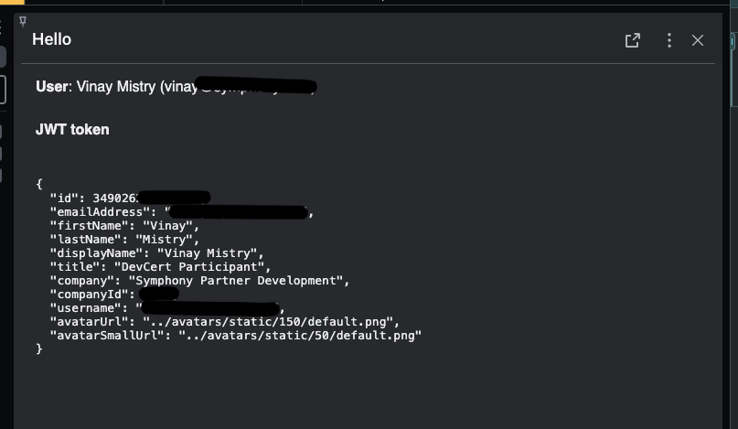

# Symphony Extension App-Auth Example

## Introduction
This is an example of how to implement Application Authentication to obtain the end users identity based on the workflow defined [here](https://docs.developers.symphony.com/ext-apps/app-authentication).

It is based on the Python BDK. If you are not familiar with the Symphony Java BDK, please have a look here: https://github.com/finos/symphony-bdk-python


## Disclaimer
This code sample is only an example. It is not meant to be directly used in a production environment. 

## Get Started
```
git clone https://github.com/mistryvinay/symphony-ext-app-auth.git
```

Add RSA private key in /rsa/privatekey-app.pem

Edit config.yaml in /resources/config.yaml
- Update host with your pod url
- Update appId for your respective application
- Optional: Update bot username and path to rsa key
- Set path to rsa key (default /rsa/privatekey-app.pem)


## Run project
### Start Services

Backend Service
- `cd backend && env/bin/python3 -m src`

Web Service
- `cd web && yarn start`

### Install Ext App
- Login to the [Develop2 Pod](https://develop2.symphony.com)
- Navigate to the Symphony Marketplace
- Find and install the 'Local 4000' application [here](https://open.symphony.com/?app/Symphony%20Developer%20Certification/localhost-4000/Localhost%204000)
- You should now see the 'My App' appear in the left navigation rail, click on the application
- A welcome page should appear that shows your user information that was obtained using the AppAuth flow

